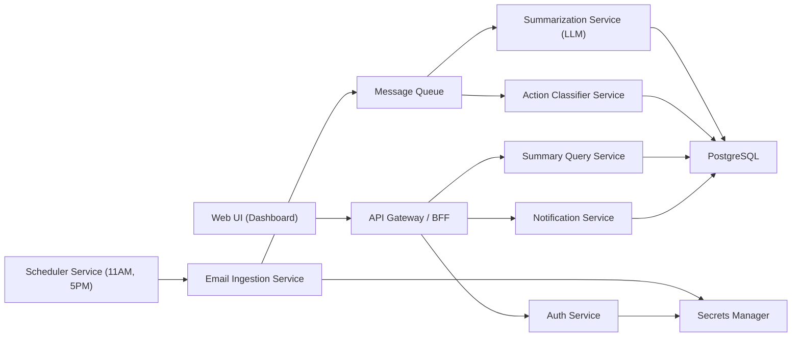

# Email Summary App - MVP Design (Microservices)

## 1) Product Goal
Build a UI app that:
- Checks connected email accounts every day at **11:00 AM** and **5:00 PM**.
- Shows a **summary dashboard** of important emails.
- Creates **notifications** when action is required (reply, approve, follow-up, deadline risk).

This is the first simple version, designed so we can add more features later.

## 2) MVP Scope

### In Scope (V1)
- Connect one mailbox provider first (recommended: Gmail or Microsoft 365).
- Scheduled mail scan at fixed times (11:00 AM, 5:00 PM in user timezone).
- AI summary for new/unread/recent emails since last scan.
- Action detection and priority tagging:
  - `urgent_action`
  - `needs_reply`
  - `fyi`
  - `low_priority`
- Dashboard with:
  - Daily summary cards
  - Priority/action list
  - "Top senders" and "Pending actions" widgets
- Notification center inside the app.

### Out of Scope (V1)
- Auto-reply emails.
- Multi-tenant enterprise RBAC complexity.
- Advanced workflow automation (Jira/CRM sync).

## 3) High-Level Architecture

## 4) Services (Microservice Boundaries)

1. **API Gateway / BFF**
   - Single backend entry for frontend.
   - Aggregates summary + notifications + actions.
   - Handles request auth token validation.

2. **Auth Service**
   - User login (OIDC/OAuth).
   - Mail provider OAuth token exchange and refresh.

3. **Scheduler Service**
   - Owns recurring jobs for each user at 11:00 and 17:00.
   - Publishes "scan mailbox" tasks.
   - Retry + idempotency key per scan window.

4. **Email Ingestion Service**
   - Pulls emails using provider API.
   - Stores normalized metadata.
   - Emits messages for summarization + action detection.

5. **Summarization Service**
   - Generates concise digest text using LLM.
   - Stores summary by user/date/scan window.

6. **Action Classifier Service**
   - Detects if action is needed.
   - Adds due-date hints and confidence score.

7. **Notification Service**
   - Creates in-app notifications when action-required items exist.
   - Manages read/unread state.

8. **Summary Query Service**
   - Read-optimized APIs for dashboard views.

## 5) Data Model (MVP)

### Core Tables
- `users(id, email, timezone, created_at)`
- `mail_accounts(id, user_id, provider, provider_account_id, token_ref, status)`
- `scan_runs(id, user_id, run_type, scheduled_for, started_at, completed_at, status)`
- `emails(id, user_id, provider_msg_id, thread_id, sender, subject, received_at, snippet, label_json)`
- `email_actions(id, email_id, action_type, priority, confidence, due_hint, status)`
- `summaries(id, user_id, scan_run_id, summary_text, model_name, created_at)`
- `notifications(id, user_id, type, title, body, related_email_id, is_read, created_at)`

## 6) API Design (V1)

### Frontend APIs (through BFF)
- `GET /api/dashboard/today`
  - Returns summary cards, high-priority actions, counts.
- `GET /api/notifications?status=unread`
- `POST /api/notifications/{id}/read`
- `GET /api/actions?status=open&priority=high`
- `POST /api/mail/connect/{provider}`
- `POST /api/scans/run-now` (manual trigger)

## 7) Scheduling Design

- Default user timezone from profile (for now: `Asia/Kolkata` configurable).
- Two daily triggers per user:
  - `11:00`
  - `17:00`
- Scheduler creates a `scan_run` record before execution.
- If run fails:
  - retry with exponential backoff,
  - keep max retry limit,
  - alert in ops logs.

## 8) Dashboard UX (Simple and Clean)

### Main Sections
1. **Header**: date/timezone + "Run Now" button.
2. **Summary Cards**:
   - Emails scanned
   - Action required
   - Urgent
   - Awaiting reply
3. **Daily Digest Panel**:
   - AI-generated summary grouped by topic.
4. **Action Required Table**:
   - Subject, sender, action type, priority, due hint.
5. **Notification Section**:
   - Unread notifications with quick mark-as-read.

## 9) Production-Readiness Baseline

- **Security**
  - OAuth tokens encrypted at rest.
  - Secrets in cloud secrets manager.
  - TLS everywhere.
- **Reliability**
  - Queue-based async processing.
  - Idempotent scan jobs.
  - Dead-letter queue for failed messages.
- **Observability**
  - Structured logs with `trace_id`.
  - Metrics: scan success rate, summary latency, notification count.
  - Basic alerting on job failures.
- **Scalability**
  - Stateless services in containers.
  - Horizontal scale for ingest/summarize workers.

## 10) Suggested Tech Stack

- **Frontend**: React + Next.js + Tailwind + component library
- **Gateway/BFF**: Node.js (NestJS) or Python (FastAPI)
- **Workers**: Python (good for email parsing + LLM orchestration)
- **DB**: PostgreSQL
- **Queue**: RabbitMQ / AWS SQS
- **Scheduler**: Temporal / Quartz / Celery Beat / Cloud Scheduler
- **Auth/OAuth**: Auth0 or cloud-native identity
- **Infra**: Docker + Kubernetes (or ECS/App Service)

## 11) MVP Delivery Plan

1. **Phase 1 - Skeleton**
   - Repo scaffold, microservices, shared contracts, DB schema.
2. **Phase 2 - Mail Connect + Scan**
   - OAuth + ingestion + scheduled scans.
3. **Phase 3 - Summary + Actions**
   - LLM summaries + action classifier + notification creation.
4. **Phase 4 - Dashboard UI**
   - Summary widgets, action table, notifications.
5. **Phase 5 - Hardening**
   - Monitoring, retries, tests, deployment pipeline.

## 12) Decisions to Confirm Before Build

- First provider: **Microsoft 365 (Office mail via Microsoft Graph)**.
- Preferred stack: **Python-first backend**.
- Deploy target: **AWS**.
